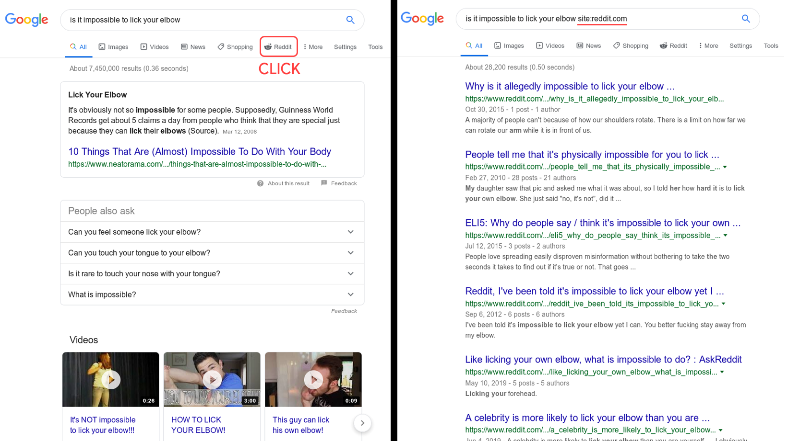

# Reddit Search On Google
A simple userscript that adds a button to your Google searches to search only for Reddit posts. You can just click on the button and it will automatically add `site:reddit.com` to your search:

## Downloading the script
The direct download link is here:

* [GreasyFork](https://greasyfork.org/en/scripts/381497-reddit-search-on-google)

**Chrome users:** you'll need a script manager extension like [TamperMonkey](https://addons.mozilla.org/en-US/firefox/addon/tampermonkey/) (the one I'm currently using) or [GreaseMonkey](https://addons.mozilla.org/en-US/firefox/addon/greasemonkey/). Then go to the download link above and click on 'Install X.X'. Finally, click on 'install' in the new window that will open.

**Firefox users:** you'll need a script manager extension like [TamperMonkey](https://chrome.google.com/webstore/detail/tampermonkey/dhdgffkkebhmkfjojejmpbldmpobfkfo?hl=en). Then go to the download link above and click on 'Install X.X'. Finally, click on 'install' in the new window that will open.

**Other browsers:** you can look for a script manager extension in your browser add-ons page. Look for Tampermonkey or Greasemonkey and install them. Then go to the download link above and click on 'Install X.X'. Finally, click on 'install' in the new window that will open.

## Customizing the script
There are a couple things you can change inside the script:

* `useIcon` can be set to `false` if you don't want to see an icon inside the Reddit button. By default it's set to `true`
* `appendRight` can be set to `true` if you want to append the Reddit button to the right of Google's buttons (next to 'Tools'). By default it's set to `false`, which appends it next to the usual buttons like 'Videos'.
